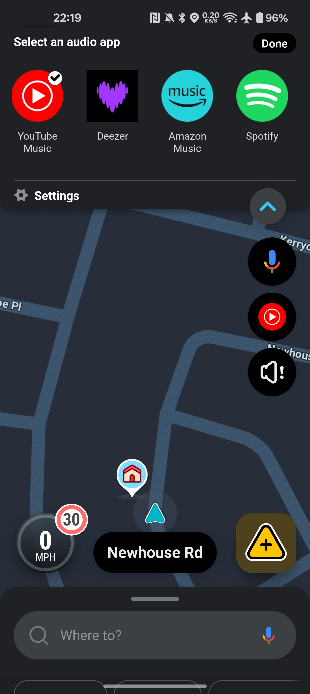
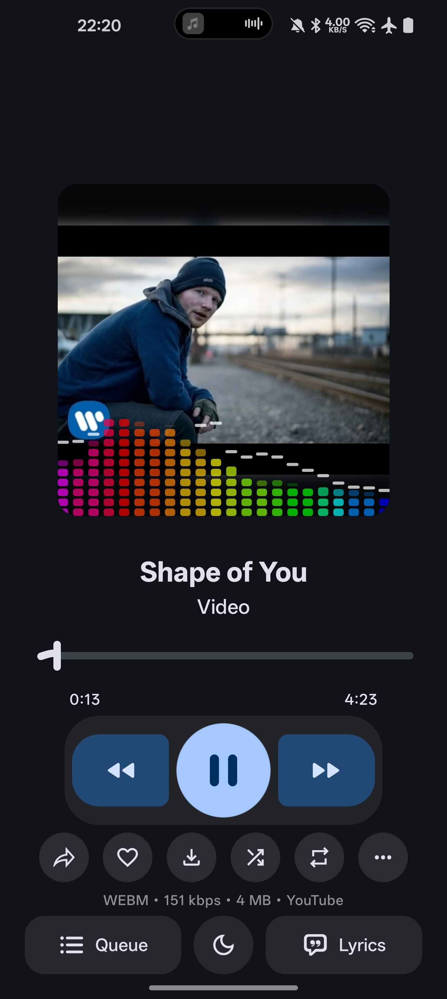
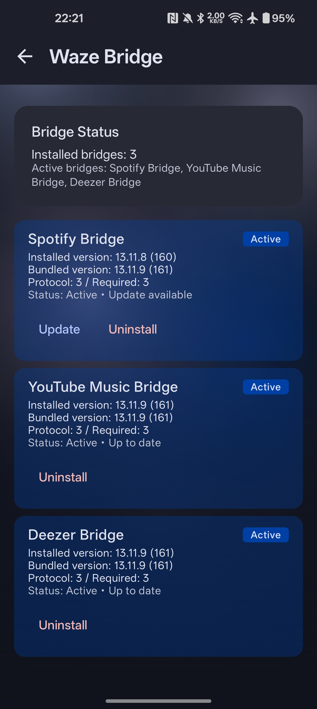
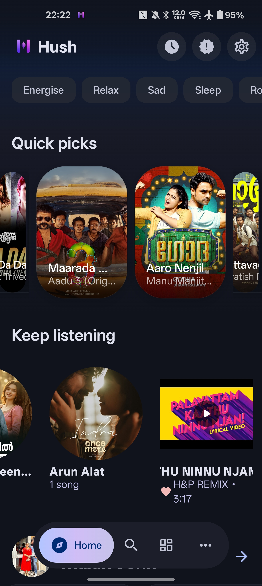
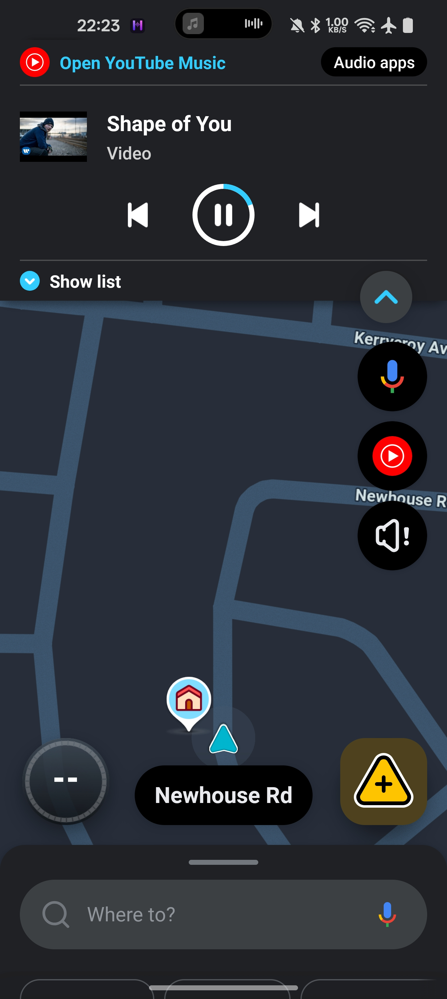
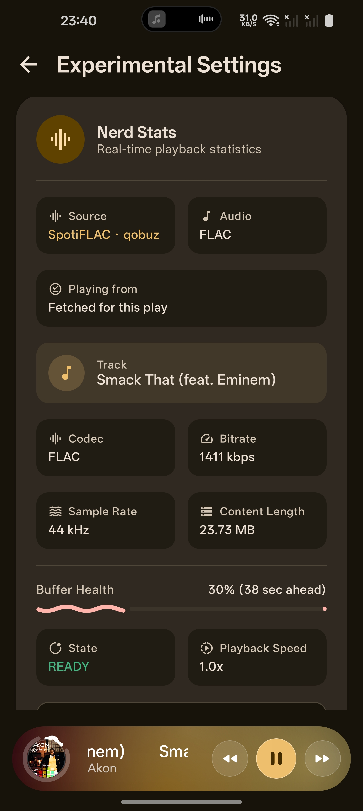

# Hush

## Music for your mood.

YT Music client for my phone and car — that can also pull lossless from the services that aren't YouTube — with Waze bridge support so you can control playback right from the dashboard. Unofficial. Sideloaded. Built for my daily drive. APKs are up. Issues are open. Use it or don't — I'm good either way, not for a crowd.

Instead of hopping between a pile of forks, I combined the best from the whole open-source stack: **[ArchiveTune](https://github.com/ArchiveTuneApp/ArchiveTune)** as the base, then pulled in the good stuff from **[Metrolist](https://github.com/metrolistgroup/metrolist)**, **[Vivi Music](https://github.com/vivizzz007/vivi-music)**, **[Echo Music](https://github.com/EchoMusicApp/Echo-Music)**, and the shared libs behind **[ViMusic](https://github.com/vfsfitvnm/ViMusic)**, **[OuterTune](https://github.com/OuterTune/OuterTune)**, and **[BetterLyrics](https://github.com/boidu-dev/BetterLyrics)** — plus the **[SpotiFLAC](https://github.com/spotiflacapp/SpotiFLAC-Mobile)** engine behind the lossless sources. One app. Most of the features. No fork roulette.

**Package:** `app.hush.music` · debug: `app.hush.music.debug`

| | |
| --- | --- |
| [Releases](https://github.com/maxinjohn/Hush/releases/latest) | Fresh APKs |
| [Obtainium](https://apps.obtainium.imranr.dev/redirect?r=obtainium://add/https://github.com/maxinjohn/Hush/) | Auto-updates, no cap |
| [Issues](https://github.com/maxinjohn/Hush/issues) | Broken install on *this* fork |
| [Privacy](PRIVACY.md) | What the app keeps & sends |
| [Changelog](CHANGELOG.md) | What shipped each version |
| [SpotiFLAC sources](#spotiflac-sources-lossless) | The lossless side in one screen |

---

## So what is Hush?

I built this for myself. My car has Waze, and Waze only shows music controls for the official apps — Spotify, YouTube Music, Deezer. None of the unofficial YT Music clients I liked (Metrolist, ArchiveTune, ViMusic) could show song info or let me skip tracks from the Waze screen. So I found a way around it.

Hush ships with tiny bridge APKs that impersonate those official apps just enough for Waze to pick them up. When you connect Hush to Waze through one of these bridges, Waze thinks it's talking to Spotify or Deezer — but it's actually controlling Hush. Song name, artist, album art, play/pause, skip, queue — all of it shows up on the Waze dashboard while you drive.

It started as a quick hack for my Android phone and my car. Then I kept adding things I wanted: better lyrics, faster downloads, backup retention, mood chips that actually work when you're logged in, a Gen‑Z style explore page. The one I wanted most turned out to be the biggest: playing from somewhere other than YouTube, so a lossless copy of a song stops being something I have to go find elsewhere. Everything I missed from the other forks — I pulled it in and made it work together.

One app. My daily driver. If it works for you too, cool.

---

## Waze Bridge

Hush ships with **bridge shim APKs** that make Waze think it's talking to Spotify, YouTube Music, or Deezer. When connected, Waze shows the current song, artist, album art, and lets you play/pause/skip right from the navigation screen.

| Bridge | Package |
|--------|---------|
| Spotify | `com.spotify.music` |
| YouTube Music | `com.google.android.apps.youtube.music` |
| Deezer | `deezer.android.app` |

This is how I get music controls in my car — Waze only talks to official apps, so Hush pretends to be one. Select which bridge to use in Settings → Waze Integration.

The bridges install themselves from the copy bundled inside Hush (Settings → Waze Integration), and can be repaired the same way — no separate download, and an update survives the install instead of needing an uninstall first.

---

## SpotiFLAC sources (lossless)

Hush can play from **Tidal, Qobuz, Amazon Music, Deezer, SoundCloud, Apple Music, Spotify Web and Pandora** — losslessly where the source has it — instead of only YouTube. The engine is SpotiFLAC's Go runtime (built from upstream's `go_backend` with gomobile) with its download extensions, and the source list comes from the two upstream registries, so a source Hush has never heard of still shows up when they add one:

- [spotiflacapp/spotiflac-extension](https://github.com/spotiflacapp/spotiflac-extension) registry
- [zarzet/spotiflac-extension](https://github.com/zarzet/spotiflac-extension) registry

Each source holds its **own signed session**, and the gateway renews one from its install id with no Cloudflare step — Hush does that in the background, hourly and again whenever you press play, so **verification is a one-time thing per source**. It only ever asks again if a session lapses (a device left off for more than six hours, say).

When a challenge is genuinely needed you get a notice with two options: solve it in the app, or — on a head unit whose WebView is older than Cloudflare supports — **Verify in browser**, where the grant comes back to Hush by itself. Nothing to copy, and it lands in the same place whichever way you solved it.

In **Settings → Audio Sources** you choose which sources are enabled, order them, and decide whether to fall back to YouTube when none of them can serve the track. Downloads and cached songs both follow **Settings → Storage**: downloads land in your downloads folder with the container the source actually served, cached songs in the song-cache folder, and with both of those wired to a folder you picked, an app reinstall keeps playing your files.

---

## Screenshots

<p align="center">
  
  
  
</p>

<p align="center">
  
  
  
</p>

---

## Loot table — who donated what

Real talk on what got ported from where. This table only moves when I add something new. Patch notes for each version → [Changelog](CHANGELOG.md).

| Source | What landed in Hush |
| --- | --- |
| **[ArchiveTune](https://github.com/ArchiveTuneApp/ArchiveTune)** | Core app, YT login & sync, playback engine, queue & downloads, crossfade, tempo/pitch, Chromecast, Music Together, Last.fm / ListenBrainz, local files, backup & restore, multi-provider lyrics, podcasts, Android Auto, dynamic theme & canvas art, onboarding, stream-source picker, custom extractor, hi-res / lossless |
| **[Metrolist](https://github.com/metrolistgroup/metrolist)** | Wake-up **music alarms**, **loudness** presets, **playlist export** (CSV / M3U), **sync dedup**, **Android Auto** settings |
| **[Vivi Music](https://github.com/vivizzz007/vivi-music)** | Playlist **view-count prefetch**, **auto-backup before update**, **backup retention**, **JioSaavn streaming** (320 kbps primary, YT fallback) |
| **[Echo Music](https://github.com/EchoMusicApp/Echo-Music)** | **5MB chunked downloads**, **isOfflinePlayback flag**, **Data Saver key**, **DoH diagnostics**, **Settings search**, **IPv4 / IPv6 / Auto** network mode |
| **[SpotiFLAC](https://github.com/spotiflacapp/SpotiFLAC-Mobile)** | **Lossless source engine** — upstream's Go runtime (gomobile `go_backend`), per-source signed sessions, source registry + extension packages, quality cascade, host-side decryption for the providers that hand back keys instead of audio, and the playback cache/download pipeline behind it. Source extensions come from [spotiflacapp](https://github.com/spotiflacapp/spotiflac-extension) and [zarzet](https://github.com/zarzet/spotiflac-extension)'s registries. |
| **Hush** | **Waze Bridge** (Spotify + YT Music + Deezer) with bundled install/repair, **Gen‑Z explore theme**, **Saavn beta warning**, **mood chip fix** (logged‑in fallback), **source priority + fallback to YouTube**, **one-time verification with background session renewal**, **browser verification for car head units**, parallel source fetch, app language selector, DOH/proxy, IP rotation UI, lyrics racing, library rewrite, auto-pause debounce, sleep timer pause fix |
| **[ViMusic](https://github.com/vfsfitvnm/ViMusic)** | InnerTube foundations, bottom-sheet UI patterns, KuGou lyrics client |
| **[OuterTune](https://github.com/OuterTune/OuterTune)** | Player carousel snap / parallax, network connectivity observer |
| **[BetterLyrics](https://github.com/boidu-dev/BetterLyrics)** | Word-synced TTML lyrics module, QRC parser |

Tiny fixes and UI polish are mixed in from everywhere. Full license wall → **About → Licenses** in the app.

---

## Shoutout the upstream homies

| Project | Bugs go here |
| --- | --- |
| [ArchiveTune](https://github.com/ArchiveTuneApp/ArchiveTune) | [Issues](https://github.com/ArchiveTuneApp/ArchiveTune/issues) |
| [Metrolist](https://github.com/metrolistgroup/metrolist) | [Issues](https://github.com/metrolistgroup/metrolist/issues) |
| [Vivi Music](https://github.com/vivizzz007/vivi-music) | [Issues](https://github.com/vivizzz007/vivi-music/issues) |
| [Echo Music](https://github.com/EchoMusicApp/Echo-Music) | [Issues](https://github.com/EchoMusicApp/Echo-Music/issues) |
| [ViMusic](https://github.com/vfsfitvnm/ViMusic) | [Issues](https://github.com/vfsfitvnm/ViMusic/issues) |
| [OuterTune](https://github.com/OuterTune/OuterTune) | [Issues](https://github.com/OuterTune/OuterTune/issues) |
| [BetterLyrics](https://github.com/boidu-dev/BetterLyrics) | [Issues](https://github.com/boidu-dev/BetterLyrics/issues) |
| [SpotiFLAC](https://github.com/spotiflacapp/SpotiFLAC-Mobile) | [Issues](https://github.com/spotiflacapp/SpotiFLAC-Mobile/issues) |
| [SpotiFLAC extensions](https://github.com/spotiflacapp/spotiflac-extension) | [Issues](https://github.com/spotiflacapp/spotiflac-extension/issues) |
| [zarzet's extensions](https://github.com/zarzet/spotiflac-extension) | [Issues](https://github.com/zarzet/spotiflac-extension/issues) |

Worth saying plainly: the lossless side of Hush is other people's work wrapped in mine — the Go runtime, the source extensions and the gateway are not mine, and bugs in a source belong upstream. Hush's own layer is the app around it: verification and session handling, source ordering and fallback, the download and cache paths, and the car side.

---

## Get the app

CI drops **universal** APKs — one file, every CPU arch, no guessing.

| APK | When |
| --- | --- |
| `hush-foss-mobile-universal-release.apk` | **Default.** Clean build, no Google libs. GitHub or Obtainium for updates. |
| `hush-gms-mobile-universal-release.apk` | You need **Chromecast** or **tap-to-update** inside the app. |
| `hush-gms-tv-universal-release.apk` | **Android TV** couch mode. |

### FOSS vs GMS — 10 sec version

Same Hush. Different sauce in the APK.

| | FOSS | GMS |
| --- | :---: | :---: |
| Play music, sync library, lyrics, settings | ✓ | ✓ |
| SpotiFLAC lossless sources (Tidal, Qobuz, Amazon, …) | ✓ | ✓ |
| Chromecast | — | ✓ |
| In-app updater | ✓ | ✓ |
| Google Play Services | **Nah** | **Only for Cast** |

### Install said "nah"?

Package conflict / invalid APK — the usual sideload ritual:

1. **Backup** → Settings → Backup and restore  
2. **Yeet** the old Hush or ArchiveTune install  
3. **Install** from [Releases](https://github.com/maxinjohn/Hush/releases/latest)  
4. **Restore** your backup  

`adb install -r your.apk` > random WhatsApp file forward. First YT Music sync might need VPN if YTM's blocked where you live.

---

## Build it yourself

```bash
bash scripts/build-release.sh list                    # see everything
bash scripts/build-release.sh foss mobile arm64       # phone FOSS
bash scripts/build-release.sh gms mobile universal    # what CI ships
bash scripts/build-release.sh gms tv universal        # TV
```

You'll want `app/keystore/release.keystore` + secrets in `local.properties` (`local.properties.example` has the template). Raw `./gradlew assemble*Release` gives you unsigned — `scripts/build-release.sh` signs it proper.

---

## Legal (sorry, required)

Unofficial third-party client. Not Google. Not YouTube. GPL-3.0. Upstream copyrights live in source where they belong.
